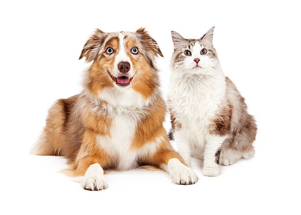

# Applied Data Science @ Columbia
## Fall 2023
## Project 1: What made you happy today?



### [Project Description](doc/Proj1_desc.md)
This is the first and only *individual* (as opposed to *team*) this semester. 

Term: Fall 2023

+ Project title: Cats, Dogs and (Happy) People
+ This project is conducted by Harini Sundararajan

+ Project summary: In this analysis, I am going to attempt to answer a series of questions pertaining to dogs and cats and their impact on human happiness. I'll consider them collectively as well as comparatively in this respect. I will be trying to answer a few questions: 
  + What makes animal lovers tick - _apart_ from animals?
  + Settling the debate - cats vs dogs (What sort of contributions do they make to happiness? How do general sentiments differ?)
+ Findings: Animal lovers tend to also be lovers of nature. Dog lovers encompass this characteristic strongly, while cat lovers prefer to spend time with their pets at home. The sentiments towards dogs and cats are generally similar.

Following [suggestions](http://nicercode.github.io/blog/2013-04-05-projects/) by [RICH FITZJOHN](http://nicercode.github.io/about/#Team) (@richfitz). This folder is organized as follows.

```
proj/
├── lib/
├── data/
├── doc/
├── figs/
└── output/
```

Please see each subfolder for a README file.
