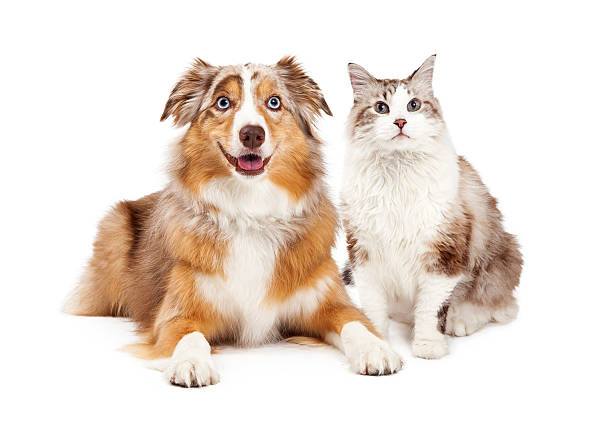
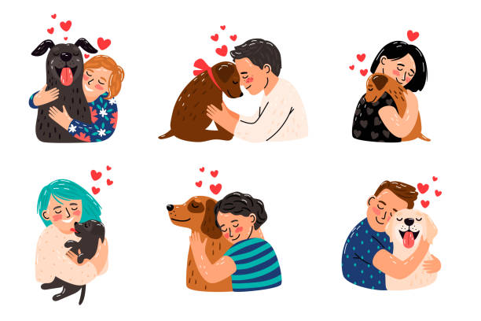
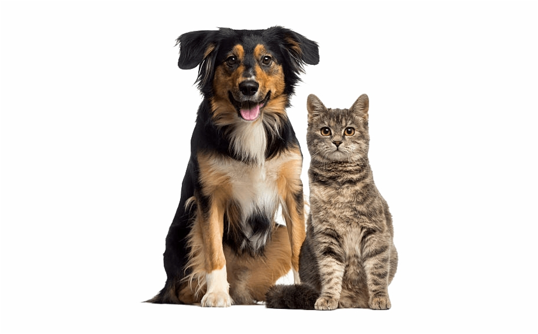

```{r setup, include=FALSE}
knitr::opts_chunk$set(echo=FALSE)
```

```{r load libraries, include=FALSE}
library(tidyverse)
library(haven)
require(scales)
library(broom)
options(digits=3)
library(kableExtra)
library(janitor)
library(htmlTable)
library(wordcloud)
library(tidytext)
library(tm)
library(topicmodels)
library(reshape2)
library(flextable)
library(knitr)
library(bookdown)
```

# Introduction

 

In this analysis, I am going to attempt to answer a series of questions pertaining to dogs and cats and their impact on human happiness. I'll consider them collectively as well as comparatively in this respect.

I'll be doing this with the help of data from the [HappyDB](https://megagon.ai/happydb-a-happiness-database-of-100000-happy-moments/) project. This project asked workers to recall three happy moments from the last 24 hours or the last 3 months, which was subsequently recorded. 

My analysis was done with the following R environmental settings:

```{r}
print(R.version)
```

I'll be using the cleaned file generated by `Text_Processing.rmd`, and will tokenize the text to obtain a bag of words which can be summarized.

```{r read data, include=FALSE}
hm_data<-read_csv('../output/processed_moments.csv')
```

```{r keep relevant columns & tokenization, include=FALSE}
hm_data_token <- hm_data %>%
  select(wid, cleaned_hm, text) %>%
  mutate(id=row_number()) %>%
  unnest_tokens(word,text)
```

Before we delve into answering the question, I will make a distinction between an animal lover and one who doesn't have strong feelings towards them. After all, if none of your happiest recollections in the recent past involve an animal, one can comfortably assume you're not overly obsessed with them. (Let's term the latter category _“neutrals”_). We will also only concern ourselves with two animals - cats and dogs - two that are often pitted against each other in their perceived lovability. (We'll revisit this dispute later!) 

The way we'll identify an animal lover is as follows: if one of your happy moments includes at least one mention of a cat or dog (or kitten or puppy), you'll be put in the animal lover bucket. To elucidate, here's some common mentions of dogs and cats in people's happy moments: 

```{r}
temp <- hm_data_token %>%
  filter(word=="dog"|word=="kitten") %>%
  select(cleaned_hm) %>%
  head(n=5)

kbl(temp, booktabs=T, col.names = c("Sentences"), caption="Cat or dog mentions") %>%
    kable_styling(full_width=T, latex_options=c("HOLD_position"), position="left", bootstrap_options = c("striped", "hover"))
```

Before we can use these words, we want to remove some words that won't aid our analysis. These include words that we've used to identify dogs and cats in happy moments. In addition, we want to keep out very common words used in people's happy moments, as they will distort future comparisons of frequencies in their favor to the point we're not able to capture other recurring words. We'll remove the top 10 most frequently occurring words, as below: 

```{r}
temp<-hm_data_token %>% 
  count(word,sort=T) %>%
  slice_max(n,n=10) %>%
  select(-n)

kbl(temp, booktabs=T, col.names = c("Words"), caption="High frequency words") %>%
    kable_styling(full_width=T, latex_options=c("HOLD_position"), position="left",bootstrap_options = c("striped", "hover"))
```

```{r remove common words, include=FALSE}
common_words <- temp %>% 
  bind_rows(tribble(~word,"cat","cats","kitten","kittens","dog","dogs","puppies","puppy"))

hm_animal <- hm_data_token %>% 
  group_by(wid) %>%
  mutate(animal=ifelse(word %in% c('cat','cats','kitten','kittens'),"cat",
                       ifelse(word %in% c('dog','dogs','puppy','puppies'),"dog","other")),
         animal_lvr=ifelse((sum(ifelse(animal!='other',1,0)))>0,"y","n")) %>% 
  ungroup()

hm_ani_cl <- hm_animal %>%
  anti_join(common_words)
```

With that out of the way, let's answer some questions.

# What makes animal lovers tick – _apart_ from animals?

 

As we've defined, an animal lover is someone who makes at least one mention of a cat or dog in their happiest moments. But what else occupies their mind – and is it something distinct from the alternate category? In other words, does an animal lover have certain common traits beyond their love of dogs and cats? 

We venture into this question with the help of word clouds which will enable us to contrast the most frequent words mentioned by both animal lovers and neutrals. This way, we can identify words that are shared by both parties, and more interestingly, those which are not. 

```{r,fig.cap="Type of words used in happy moments - animal lovers"}

hm_ani_cl %>%
  filter(animal_lvr=='y') %>%
  count(word) %>%
  with(wordcloud(word, n,
                 scale=c(1.25,0.5),
                 max.words=40,
                 min.freq=1,
                 random.order=FALSE,
                 rot.per=0.2,
                 use.r.layout=T,
                 random.color=F,
                 colors=brewer.pal(9,"Greens")))
```

```{r,fig.cap="Type of words used in happy moments - neutrals"}
hm_ani_cl %>%
  filter(animal_lvr=='n') %>%
  count(word) %>%
  with(wordcloud(word, n,
                 scale=c(1.25,0.5),
                 max.words=40,
                 min.freq=1,
                 random.order=FALSE,
                 rot.per=0.2,
                 use.r.layout=T,
                 random.color=F,
                 colors=brewer.pal(9,"Reds")))
```

The above word clouds give us a picture of what words occur the most frequently in our two buckets - we can identify a few words that are more frequent among animal lovers, such as morning and walk.

```{r,fig.cap="Type of words used in happy moments - comparison cloud"}
hm_ani_cl %>%
  count(word, animal_lvr, sort = TRUE) %>%
  acast(word ~ animal_lvr, value.var = "n", fill = 0) %>%
  comparison.cloud(colors = c("red3", "green4"),
                   max.words = 100, scale=c(1.25, .5),
                   title.size=2)
```

In the above figure, we've plotted the comparison cloud of the two categories – animal lovers and neutrals – in terms of words they use in their happiest moments. We immediately see some disparities between the groups in the occurrence of certain words. Let's go a bit deeper for some of those. 

What jumps out is the presence of words related to the outdoors among animal lovers. Rain, walk, morning, park, and weather are a few examples. Are animal lovers also lovers of nature? Let's look at example sentences for these words. 

```{r}
temp <- hm_ani_cl %>%
  filter(animal_lvr=="y"&(word=="weather")) %>%
  select(cleaned_hm) %>%
  head(n=5)

kbl(temp, booktabs=T, col.names = c("Sentences"), caption="Weather mentions") %>%
    kable_styling(full_width=T, latex_options=c("HOLD_position"), position="left", bootstrap_options = c("striped", "hover"))
```

```{r}
temp <- hm_ani_cl %>%
  filter(animal_lvr=="y"&(word=="morning")) %>%
  select(cleaned_hm) %>%
  head(n=5)

kbl(temp, booktabs=T, col.names = c("Sentences"), caption="Morning mentions") %>%
    kable_styling(full_width=T, latex_options=c("HOLD_position"), position="left", bootstrap_options = c("striped", "hover"))
```

Another word that isn't present in the neutral category is “cuddled”. We can look at some examples for this as well. 

```{r}
temp <- hm_ani_cl %>%
  filter(animal_lvr=="y"&(word=="cuddled")) %>%
  select(cleaned_hm) %>%
  head(n=5)

kbl(temp, booktabs=T, col.names = c("Sentences"), caption="Cuddle mentions") %>%
    kable_styling(full_width=T, latex_options=c("HOLD_position"), position="left", bootstrap_options = c("striped", "hover"))
```

Very few of these examples mention a non-animal as the subject of this cuddling. What's the percentage of mentioning “cuddled” in relation to an animal versus something else? 

```{r}
temp <- hm_ani_cl %>% 
  filter(animal_lvr=="y"&(word=="cuddled")) %>%
  select(id,cleaned_hm) %>%
  inner_join((hm_animal %>% select(id,word,Animal=animal)),relationship='many-to-many',by="id") %>%
  count(Animal) %>% mutate(Proportion=percent(n/sum(n))) %>% select(-n)

kbl(temp,booktabs=T, caption="Percentage mention of cuddling w.r.t animals", col.names = c("Animal","%"), align=c("ll")) %>%
    kable_styling(full_width=F,position="left", latex_options=c("HOLD_position"))
```

Compare this to the percentage of dog/cat mentions in sentences including the outdoors-related words. It seems a predilection for nature has a high occurrence of happy moments amongst animal lovers, regardless of the involvement of an animal.

```{r}
temp1 <- hm_ani_cl %>% 
  filter(animal_lvr=="y"&(word=="morning")) %>%
  select(id,cleaned_hm) %>%
  inner_join((hm_animal %>% select(id,word,Animal=animal)),relationship='many-to-many',by="id") %>%
  count(Animal) %>% mutate(Morning=percent(n/sum(n))) %>% select(-n)

temp2 <- hm_ani_cl %>% 
  filter(animal_lvr=="y"&(word=="weather")) %>%
  select(id,cleaned_hm) %>%
  inner_join((hm_animal %>% select(id,word,Animal=animal)),relationship='many-to-many',by="id") %>%
  count(Animal) %>% mutate(Weather=percent(n/sum(n))) %>% select(Weather)

temp3 <- hm_ani_cl %>% 
  filter(animal_lvr=="y"&(word=="rain")) %>%
  select(id,cleaned_hm) %>%
  inner_join((hm_animal %>% select(id,word,Animal=animal)),relationship='many-to-many',by="id") %>%
  count(Animal) %>% mutate(Rain=percent(n/sum(n))) %>% select(Rain)

temp <- temp1 %>% bind_cols(temp2,temp3)

kbl(temp,booktabs=T, caption="Percentage mentions w.r.t animals", col.names = c("Animal","Morning %","Weather %","Rain %"), align=c("llll")) %>%
    kable_styling(full_width=F,position="left", latex_options=c("HOLD_position"))
```

Some other words occur frequently in the animal lover category which are obviously tied to their furry friend – adopted, pet, shelter, vet. Looking at the neutral group, we see words related to children (college, exam, class, school), family (marriage, kids, parents, relatives, baby), socializing (function, event, party), and work (office, promotion, job, company). 

Broadly, we see a clear difference between animal lovers and our neutral category, where the outdoors and nature seem to positively impact animal lovers independent of an animal influence.

# Settling the Debate: Cats versus Dogs

 

We'll briefly reformat our data to have our cat/dog classification at a "sentence-level" (whether a sentence mentions a dog or cat) as opposed to the previous "person-level" (whether a person mentions a dog or cat). sentence-level. We can now look at the proportion of animal-related sentences that mention cats vs dogs. 

```{r include=FALSE}
ani_ids <- hm_animal %>%
  group_by(id) %>%
  select(id, animal) %>%
  filter(animal!="other") %>%
  distinct()

hm_catdog <- hm_ani_cl %>%
  inner_join(ani_ids, by="id",relationship='many-to-many')
```

Of the sentences that mention an animal, 69% mention a dog and 31% mention a cat. Immediately, we see that dogs are more popular between the two in happy instances. 

```{r}
temp <- ani_ids %>%
  ungroup() %>%
  count(animal) %>%
  mutate(percent(n/sum(n)))

kbl(temp, booktabs=T, caption="Percentage of dog vs cat sentences", 
    col.names = c("Animal","Count","%"), align=c("lll")) %>%
  kable_styling(full_width=F, position="left", latex_options=c("HOLD_position"))
```

## What sort of contributions do cats vs dogs make towards happiness?

We're not done here, though. We're still interested in exploring the kinds of happy moments people have in relation to dogs and cats. We can once again utilise comparison clouds – except now we're looking at sub-categories of animal lovers against each other. 

```{r,fig.cap="Type of words used in happy moments"}
hm_catdog %>%
  count(word, animal.y, sort = TRUE) %>%
  acast(word ~ animal.y, value.var = "n", fill = 0) %>%
  comparison.cloud(colors = c("orange3", "brown4"),
                   max.words = 100, scale=c(1.25, .5),
                   title.size=2)
```

There's a clear contrast to be seen here - happy moments with dogs involve more mentions of outside activities, like running, walking, the park, and hikes; as well as rainy to sunny weather. On the other hand, there's a trend of staying at home and relaxation with cats - couch, TV and bed as well as sleep, cuddling and nap indicate this. 

```{r}
temp <- hm_catdog %>%
  filter(animal.y=="dog"&(word=="hike"|word=="park"|word=="run")) %>%
  select(cleaned_hm) %>% distinct() %>%
  head(n=5)

kbl(temp, booktabs=T, col.names = c("Sentences"), caption="Happy moments with dogs") %>%
    kable_styling(full_width=T, latex_options=c("HOLD_position"), position="left", bootstrap_options = c("striped", "hover"))
```

```{r}
temp <- hm_catdog %>%
  filter(animal.y=="cat"&(word=="couch"|word=="tv"|word=="nap")) %>%
  select(cleaned_hm) %>% distinct() %>%
  head(n=5)

kbl(temp, booktabs=T, col.names = c("Sentences"), caption="Happy moments with cats") %>%
    kable_styling(full_width=T, latex_options=c("HOLD_position"), position="left", bootstrap_options = c("striped", "hover"))
```

It seems clear that dogs and cats contribute in entirely different ways to people's happiness - and both ways are equally important.

## How do sentiments differ?

Is there any difference in the sentiments felt towards dogs versus cats? We'll be using [NRC](http://saifmohammad.com/WebPages/NRC-Emotion-Lexicon.htm) and [Afinn](http://www2.imm.dtu.dk/pubdb/pubs/6010-full.html) to explore this. 

We only want words that contribute a positive/neutral sentiment to the sentence, since we're concerned with happy moments. We only include "anticipation", "surprise", "trust" and "joy" in NRC, and values greater than or equal to 0 for Afinn.

```{r include=FALSE}
nrc_pos <- get_sentiments("nrc") %>% 
  filter(sentiment == "joy"|sentiment == "anticipation"|sentiment == "surprise"|sentiment == "trust")%>%
  anti_join(common_words)

afinn_pos<-get_sentiments("afinn") %>% 
  filter(value>=0)%>%
  anti_join(common_words)
```

```{r,fig.cap="Sentiments towards dogs vs cats - NRC",message=FALSE}
hm_catdog %>%
  select(cleaned_hm,word,animal=animal.y) %>%
  inner_join(nrc_pos,relationship='many-to-many',by="word") %>%
  group_by(animal,sentiment) %>%
  summarize(n=n()) %>%
  mutate(prop=n/sum(n)) %>%
  ggplot(aes(reorder(sentiment,-prop),prop,fill=animal)) +
  geom_col(show.legend=F) +
  scale_y_continuous(labels = percent) + 
  labs(x="Sentiment",y="Words (%)") +
  facet_wrap(~animal)
```

In the case of NRC word-emotion associations, the distributions of sentiments are broadly similar with some minor variations, with slightly lower and higher occurrence of joy and surprise categories respectively, for dogs compared to cats.

```{r,fig.cap="Sentiments towards dogs vs cats - Afinn", out.width= "90%",message=FALSE}
hm_catdog %>%
  select(cleaned_hm,word,animal=animal.y) %>%
  inner_join(afinn_pos,relationship='many-to-many',by="word") %>%
  group_by(animal,value) %>%
  summarize(n=n()) %>%
  mutate(prop=n/sum(n)) %>%
  ggplot(aes(value,prop, fill=animal)) +
  geom_col(show.legend=F) +
  scale_y_continuous(labels = percent) + 
  labs(x="Sentiment value",y="Words (%)") +
  facet_wrap(~animal)
```

The case is similar with Afinn, except cats show a slight skew towards lower intensities of positive sentiments. Broadly, though, we see little major differences in how cats and dogs are sentimentally viewed with regards to the words used in association with them.

# Conclusion

We endeavored to understand a few things - what drives animal lovers outside of their love for animals, how do cat vs dog lovers differ in the kinds of moments they cherish, and finally is there any difference in the general positive sentiments towards dogs and cats?

Based on what we've seen, it appears that animal lovers generally have a stronger appreciation for nature and the weather. We saw this strongly reflected in happy moments shared with dogs, which typically occur during outside activities. On the flipside, moments with cats are more common in a relaxed, domestic setting.

Despite the fewer instances of cat mentions in happy moments, I'd like to crudely hypothesize that happiness from cats is less often a particular moment and more often their general presence - cats tend to simply exist and provide a continuous flow of joy. With dogs, there are typically more activities that one does with them - visits to the park, walks and hikes - resulting in a more concrete formation of a _moment_ in time.

To end, we briefly conducted sentiment analysis, seeing that words used in association with dogs and cats are also roughly similar in sentiment.

And this concludes the deep-dive into animal lovers and happiness!

